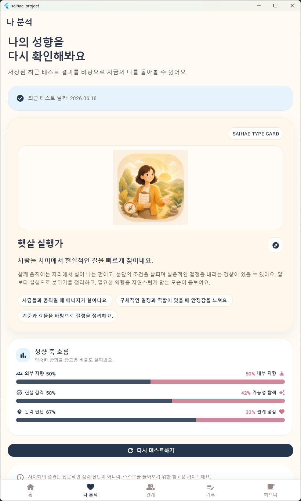
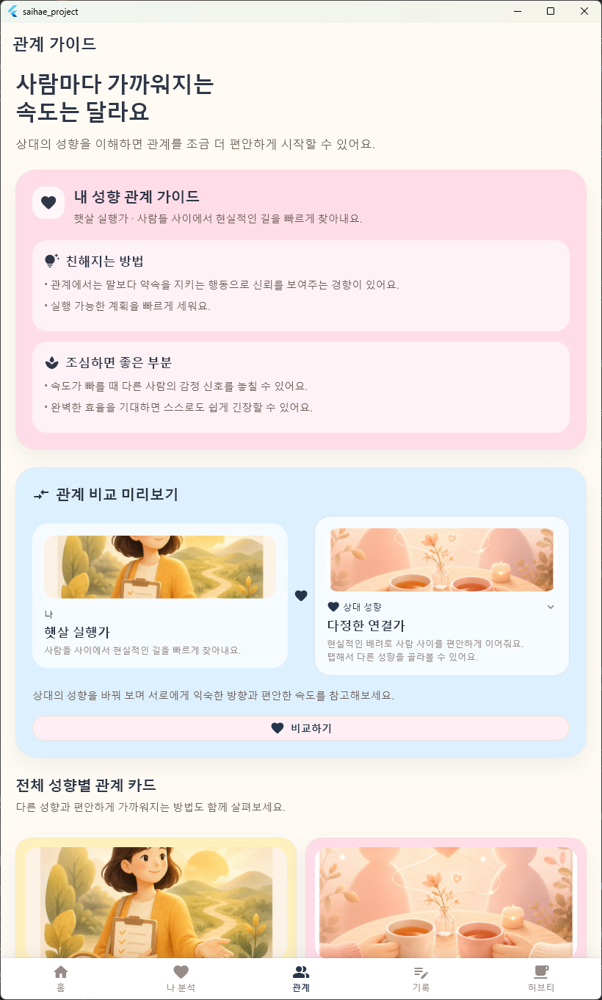
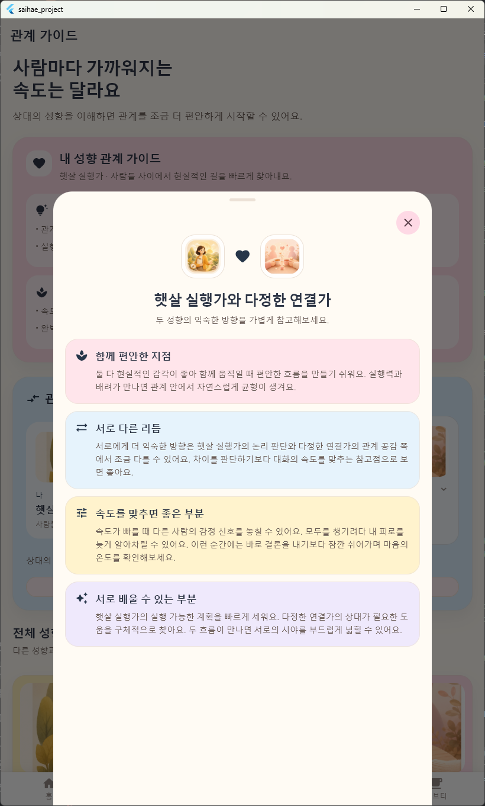
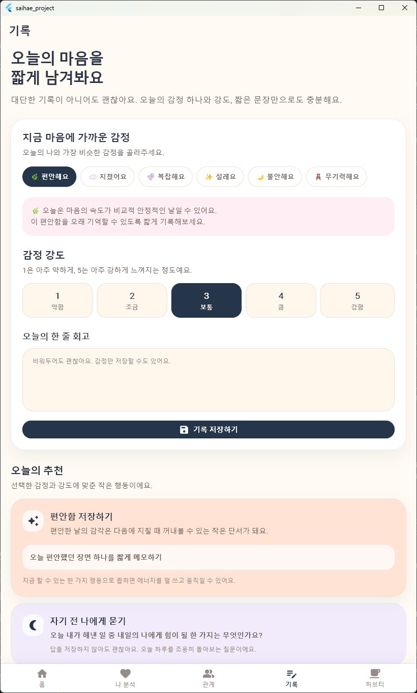
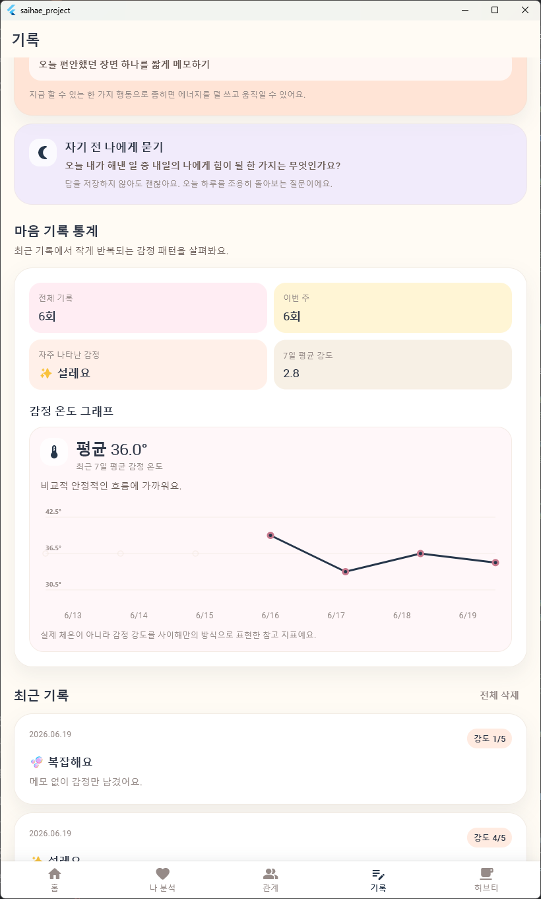
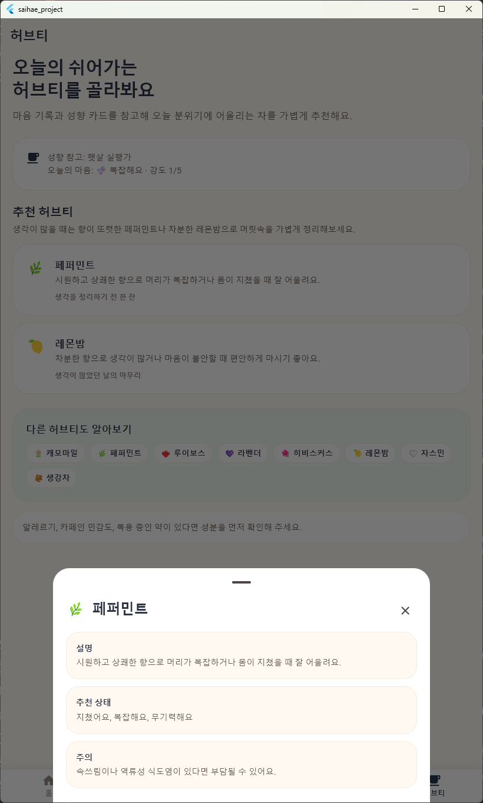
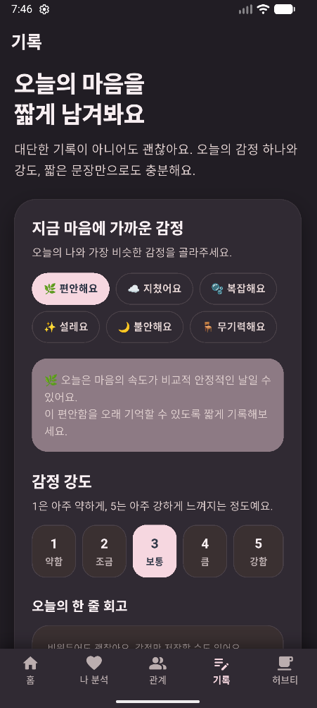
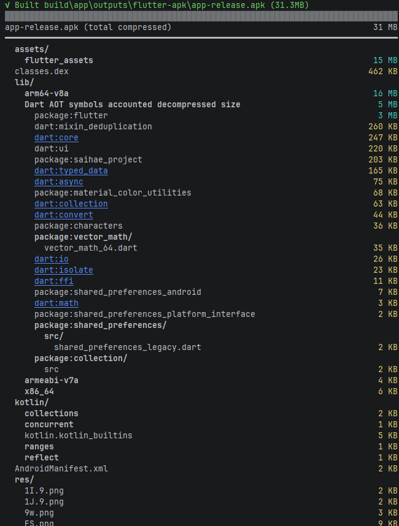
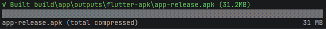

# 사이해 (SAIHAE)

> **“사이를 이해하다”와 “나를 이해하다”**를 담은 Flutter 기반 정서적 자기이해·관계 웰니스 앱

**사이해**는 오늘의 감정을 가볍게 기록하고, 성향 테스트를 통해 나의 관계 스타일을 돌아보며, 관계 가이드와 허브티 추천으로 일상적인 자기돌봄을 돕는 모바일 앱입니다.  
이 프로젝트는 전문 심리 진단이나 상담 서비스가 아니라, 사용자가 **나를 이해하고 관계를 이해하는 경험**을 부드럽게 제공하는 데 초점을 둡니다.

---

## 1. 프로젝트 소개

| 항목 | 내용 |
|---|---|
| 프로젝트명 | 사이해 (SAIHAE) |
| 한 줄 소개 | 감정 기록, 성향 분석, 관계 가이드, 허브티 추천을 제공하는 관계 웰니스 앱 |
| 핵심 컨셉 | 나를 이해하고, 관계를 이해하는 앱 |
| 개발 환경 | Flutter / Dart |
| UI 방향 | 따뜻하고 부드러운 감성의 Material 기반 카드 UI |
| 저장 방식 | `shared_preferences`를 이용한 기기 내 로컬 저장 |
| 주요 탭 | 홈, 나 분석, 관계, 기록, 허브티 |
| 비고 | 로그인, 클라우드 서버, 외부 AI API 연동은 현재 코드에 구현되어 있지 않습니다. |

사이해는 사용자가 자신의 마음을 “검사받는” 느낌보다, 오늘의 상태를 천천히 관찰하고 정리하는 경험을 제공하도록 설계했습니다. 감정 기록과 성향 결과는 앱 내부 저장소에 보관되며, 관계 가이드는 단정적인 궁합 판단이 아니라 서로의 차이를 이해하는 방향으로 구성했습니다.

---

## 2. 주요 기능

### 2-1. 앱 초기 화면

앱 실행 시 `images/first_screen.png`를 사용하는 시작 화면이 먼저 표시됩니다. 이후 메인 탭 화면으로 진입합니다.

### 2-2. 홈 화면

홈 화면은 오늘의 마음 체크를 가장 먼저 보여주고, 감정 기록·성향 테스트·관계 비교로 자연스럽게 이동할 수 있도록 구성했습니다.

- 오늘 남긴 감정 기록이 있으면 최근 기록을 확인할 수 있습니다.
- 아직 기록하지 않았다면 감정을 선택해 기록 탭으로 이동할 수 있습니다.
- 저장된 성향 결과가 있으면 홈에서도 간단히 확인할 수 있습니다.
- 관계 비교와 전체 유형 보기로 이동하는 바로가기 카드를 제공합니다.

### 2-3. 감정 기록

기록 탭에서는 오늘의 감정, 감정 강도, 한 줄 회고를 저장할 수 있습니다.

- 감정 이모지와 라벨 선택
- 1~5 단계 감정 강도 선택
- 선택 입력 가능한 한 줄 메모
- 저장된 기록 목록 확인
- 전체 기록 삭제 기능
- 기록 기반 통계와 추천 문구 제공

### 2-4. 성향 테스트

성향 테스트는 12개 질문으로 구성되어 있으며, 각 질문은 4단계 선택지로 답변합니다. 질문은 에너지 방향, 정보 인식 방식, 판단 방식의 축을 활용해 결과를 계산합니다.

- 기존 8문항에서 12문항으로 확대
- MBTI식 성향 구분 방식을 참고하되, 앱 목적에 맞게 재구성
- 8가지 사이해 성향 결과 제공
- 각 성향별 이름, 설명, 강점, 주의점, 관계 스타일, 추천 행동 제공
- 결과는 로컬 저장소에 저장되어 나 분석 탭에서 다시 확인 가능

현재 구현된 8가지 성향은 다음과 같습니다.

| 성향 ID | 성향 이름 | 간단 설명 |
|---|---|---|
| `field_captain` | 햇살 실행가 | 사람들 사이에서 현실적인 길을 빠르게 찾아내요. |
| `warm_coordinator` | 다정한 연결가 | 현실적인 배려로 사람 사이를 편안하게 이어줘요. |
| `idea_pathfinder` | 바람길 기획가 | 새로운 가능성을 사람들과 논리적으로 펼쳐봐요. |
| `dream_weaver` | 반짝임 나눔가 | 사람들의 마음과 가능성을 함께 밝히는 편이에요. |
| `quiet_builder` | 고요한 설계자 | 차분한 관찰로 단단한 현실의 답을 만들어요. |
| `gentle_keeper` | 포근한 지킴이 | 조용한 배려로 가까운 사람의 하루를 살펴요. |
| `inner_strategist` | 달빛 탐구가 | 혼자 깊이 생각하며 가능성의 구조를 찾아요. |
| `soft_lantern` | 은은한 상상가 | 조용한 마음속에서 다정한 가능성을 키워요. |

### 2-5. 나 분석 탭

나 분석 탭은 저장된 성향 결과를 중심으로 사용자의 관계 스타일과 분석 정보를 보여줍니다.

- 최근 테스트 날짜 표시
- 성향 결과 카드 표시
- 축별 점수 요약 표시
- 다시 테스트하기 기능
- 결과가 없을 경우 테스트 시작 안내 제공

### 2-6. 관계 탭

관계 탭은 성향별 관계 가이드와 성향 비교 기능을 제공합니다.

- 내 성향이 저장되어 있으면 내 성향 관계 가이드를 우선 표시
- 저장된 결과가 없으면 성향 테스트를 유도
- 전체 8가지 성향별 관계 카드 제공
- 상대 성향을 선택해 내 성향과 비교 가능
- “잘 맞는다/안 맞는다”로 단정하기보다, 서로의 표현 방식과 속도를 이해하도록 구성

### 2-7. 허브티 추천 탭

허브티 탭은 현재 마음 상태에 어울리는 허브티를 추천합니다. 심리 진단처럼 딱딱하게 분류하기보다, 오늘의 감정에 맞는 자기돌봄 루틴을 제안하는 방식으로 구성했습니다.

- 최근 감정 기록 기반 추천
- 감정별 추천 메시지 제공
- 캐모마일, 페퍼민트, 루이보스, 라벤더, 히비스커스, 레몬밤, 자스민 등 허브티 데이터 포함
- 추천 상황과 주의사항 안내

### 2-8. 다크모드

앱은 시스템 설정을 따르는 라이트/다크 테마를 제공합니다. 카드, 배경, 바텀 내비게이션, 시트 배경 등이 다크모드에서도 자연스럽게 보이도록 테마를 분리했습니다.

---

## 3. 화면 미리보기

> 아래 이미지는 `images/` 폴더에 포함된 기말 프로젝트용 스크린샷입니다.

| 초기 화면 | 홈 화면 |
|---|---|
|  |  |

| 나 분석 탭 | 관계 탭 - 관계 가이드 |
|---|---|
|  |  |

| 관계 탭 - 관계 가이드 | 관계 탭 - 성향 비교 |
|---|---|
|  |  |

| 기록 탭 | 기록 탭 상세 |
|---|---|
|  |  |

| 허브티 추천 탭 | 다크모드 |
|---|---|
|  |  |

---

## 4. 중간고사 이후 개선 사항

2026년 5월 5일 이후 git 기록과 현재 코드를 기준으로 확인한 주요 개선 사항입니다.

### 4-1. 성향 테스트 개편

- 테스트 질문이 12개로 구성되었습니다.
- 에너지, 인식, 판단 축을 사용해 8가지 성향 결과를 계산하도록 구성했습니다.
- 각 성향의 이름과 설명을 앱의 감성에 맞게 새로 작성했습니다.
- `images/personality_cards/`에 8가지 성향 카드 이미지가 추가되어 결과와 관계 화면의 시각적 완성도를 높였습니다.

### 4-2. 초기 화면 추가

- 앱 시작 시 `images/first_screen.png` 기반의 첫 화면을 보여주도록 구성했습니다.
- 짧은 스플래시 이후 메인 탭 화면으로 이동합니다.

### 4-3. 홈 화면 개선

- 감정 기록 진입점을 홈 상단에 배치했습니다.
- 오늘 이미 기록한 감정이 있으면 완료 상태를 보여주고, 다시 체크할 수 있도록 했습니다.
- 성향 결과, 관계 비교, 유형 보기 등 주요 기능으로 이동하는 흐름을 강화했습니다.

### 4-4. 나 분석 탭 개선

- 저장된 성향 결과와 테스트 날짜, 점수 요약을 보여주는 화면으로 구성했습니다.
- 결과가 없을 경우 테스트를 시작할 수 있는 안내 화면을 제공합니다.

### 4-5. 관계 탭 기능 추가/개선

- 성향별 관계 가이드 카드가 확장되었습니다.
- 내 성향과 상대 성향을 선택해 비교하는 기능이 추가되었습니다.
- 관계를 단정적으로 판단하기보다, 서로의 속도와 표현 방식 차이를 이해하도록 문구를 구성했습니다.

### 4-6. 기록 탭 추가/개선

- 감정 기록 저장, 목록 확인, 기록 삭제, 통계 확인 흐름을 구성했습니다.
- 감정 강도와 최근 기록을 바탕으로 추천 문구와 자기돌봄 질문을 제공합니다.

### 4-7. 허브티 추천 탭 추가/개선

- 최근 감정 기록 또는 오늘의 마음 상태에 따라 허브티를 추천하는 탭이 추가되었습니다.
- 허브티별 추천 상황과 주의사항을 함께 제공해 일상적인 자기돌봄 느낌을 살렸습니다.

### 4-8. 다크모드와 UI/UX 개선

- `ThemeMode.system`을 사용해 시스템 설정에 따라 라이트/다크 테마가 적용됩니다.
- 카드 UI, 색상 팔레트, 바텀 내비게이션, 모달 시트 등의 시각 요소가 다크모드에서도 자연스럽게 보이도록 개선되었습니다.

---

## 5. 기술 스택 및 패키지

### 5-1. 기술 스택

- **Flutter**: 모바일 앱 UI 및 화면 흐름 구현
- **Dart**: 앱 로직, 데이터 모델, 서비스 구현
- **Material Design 기반 UI**: AppBar, BottomNavigationBar, Card, Modal Bottom Sheet 등 사용
- **Local Storage**: 사용자 기록과 성향 결과를 기기 내부에 저장

### 5-2. `pubspec.yaml` 기준 사용 패키지

| 패키지 | 용도 |
|---|---|
| `flutter` | Flutter 앱 개발 SDK |
| `shared_preferences` | 감정 기록, 성향 테스트 결과, 앱 설정의 로컬 저장 |
| `flutter_native_splash` | 네이티브 스플래시 화면 설정용 패키지 |
| `flutter_lints` | Dart/Flutter 권장 린트 규칙 적용 |
| `flutter_launcher_icons` | 앱 런처 아이콘 생성 설정 |

### 5-3. 용량 최적화 분석

13강 강의에서 진행한 앱 용량 최적화 실습 결과를 README에 함께 정리했습니다. JSON으로 용량을 분석했을 때, 큰 비중을 차지한 항목은 패키지보다 이미지 assets였으며 특히 `images/personality_cards` 폴더가 가장 큰 비중을 차지했습니다.

| 항목 | 크기/분석 결과 |
|---|---:|
| `lib` 전체 | 약 **15.62MB** |
| `assets` 전체 | 약 **14.76MB** |
| `images` 전체 | 약 **14.54MB** |
| `images/personality_cards` | 약 **12.86MB** / JSON 기준 **13,487,968 bytes** |
| `first_screen.png` | 약 **1.67MB** / JSON 기준 **1,756,073 bytes** |
| `CupertinoIcons.ttf` | 약 **113KB** / JSON 기준 **115,944 bytes** |

분석 결과, 실제 앱 용량에서 가장 큰 부분은 `CupertinoIcons.ttf`보다 성향 카드 이미지들이었습니다. 다만 현재 코드에서 `CupertinoIcons`를 직접 사용하지 않기 때문에 불필요한 의존성인 `cupertino_icons: ^1.0.8`을 삭제했습니다. 그 결과 기존 애플리케이션 용량은 **31.3MB**였고, 최적화 후에는 **31.2MB**로 약 **0.1MB** 감소했습니다.

용량 최적화 전후 분석 캡처는 `images/before.png`와 `images/after.png`로 `images/` 폴더에 추가했습니다. 아래 이미지를 통해 `cupertino_icons` 제거 전후의 빌드 분석 결과와 최종 APK 용량 변화를 확인할 수 있습니다.

| 최적화 전 | 최적화 후 |
|---|---|
|  |  |

- **최적화 전**: `images/personality_cards`와 `first_screen.png` 등 이미지 assets가 앱 용량의 큰 비중을 차지하는 것을 확인했습니다.
- **최적화 후**: 사용하지 않는 `cupertino_icons` 의존성을 제거해 APK 용량을 **31.3MB → 31.2MB**로 줄였습니다.
- **추가 개선 여지**: 현재 가장 큰 용량 항목은 이미지 assets이므로, 추후 성향 카드 이미지 WebP 변환과 해상도 조정을 진행하면 더 큰 폭의 용량 절감이 가능합니다.

### 5-4. Assets 구성

| 경로 | 역할 |
|---|---|
| `images/first_screen.png` | 앱 초기 화면 이미지 및 README 스크린샷 |
| `images/*.png` | README 및 발표용 앱 화면 스크린샷 |
| `images/personality_cards/` | 8가지 성향 카드 이미지 |
| `assets/icons/app_icon.png` | 앱 런처 아이콘 원본 |
| `assets/icons/app_icon_0.png` | 앱 아이콘 관련 추가 이미지 |

`pubspec.yaml`에는 현재 `images/first_screen.png`와 `images/personality_cards/`가 Flutter assets로 등록되어 있습니다. 성향 카드 이미지는 앱의 감성적인 완성도를 높이지만, 용량 분석 결과에서도 가장 큰 비중을 차지하므로 향후 WebP 변환, 해상도 조정, 필요한 이미지만 번들링하는 방식의 추가 최적화가 필요합니다.

---

## 6. 프로젝트 구조

```text
lib/
├─ main.dart                         # 앱 실행 진입점
├─ app/
│  ├─ app.dart                       # MaterialApp, 초기 화면, 메인 탭 연결
│  └─ theme.dart                     # 라이트/다크 테마, 색상, 간격, 카드 스타일
├─ data/
│  ├─ bedtime_question_data.dart     # 감정/강도/성향 기반 자기돌봄 질문 데이터
│  ├─ emotion_data.dart              # 감정 목록과 안내 문구
│  ├─ herbal_tea_data.dart           # 허브티 추천 데이터
│  ├─ personality_data.dart          # 8가지 성향 결과 데이터
│  ├─ personality_match_data.dart    # 성향 간 관계 비교 데이터
│  ├─ recommendation_data.dart       # 감정 기반 추천 행동 데이터
│  ├─ test_question_data.dart        # 12개 성향 테스트 질문 데이터
│  └─ tip_data.dart                  # 홈 화면 작은 회복 팁 데이터
├─ models/
│  ├─ app_settings.dart              # 앱 설정 모델
│  ├─ emotion_record.dart            # 감정 기록 모델
│  ├─ mental_tip.dart                # 회복 팁 모델
│  ├─ personality_match.dart         # 성향 비교 모델
│  ├─ personality_test_result.dart   # 성향 테스트 결과 모델
│  ├─ personality_type.dart          # 성향 유형 모델
│  ├─ recommendation_item.dart       # 추천 항목 모델
│  └─ test_question.dart             # 테스트 질문/축/선택지 모델
├─ screens/
│  ├─ analysis_screen.dart           # 나 분석 탭
│  ├─ herbal_tea_screen.dart         # 허브티 추천 탭
│  ├─ home_screen.dart               # 홈 화면
│  ├─ main_tab_screen.dart           # 5개 탭 구조
│  ├─ onboarding_screen.dart         # 온보딩 화면 코드
│  ├─ record_screen.dart             # 감정 기록 탭
│  ├─ relation_guide_screen.dart     # 관계 가이드/성향 비교 탭
│  ├─ result_screen.dart             # 성향 테스트 결과 화면
│  └─ test_screen.dart               # 성향 테스트 진행 화면
├─ services/
│  ├─ emotion_stats_service.dart     # 감정 기록 통계 계산
│  ├─ local_storage_service.dart     # shared_preferences 저장/조회
│  └─ personality_test_service.dart  # 성향 테스트 점수 계산
└─ widgets/
   ├─ emotion_chip.dart              # 감정 선택 칩
   ├─ recommendation_card.dart       # 추천 카드
   ├─ result_card.dart               # 성향 결과 카드
   ├─ rounded_button.dart            # 둥근 버튼
   ├─ section_title.dart             # 섹션 제목
   └─ soft_card.dart                 # 공통 소프트 카드 UI
```

그 외 플랫폼별 실행 파일은 `android/`, `ios/`, `web/`, `macos/`, `linux/`, `windows/`에 Flutter 기본 구조로 포함되어 있습니다. 테스트 코드는 `test/` 폴더에 기능별로 분리되어 있습니다.

---

## 7. 실행 방법

### 7-1. 사전 준비

- Flutter SDK 설치
- Android Studio 또는 VS Code 등 Flutter 개발 환경 준비
- Android Emulator, iOS Simulator 또는 실제 디바이스 준비

### 7-2. 의존성 설치

```bash
flutter pub get
```

### 7-3. 앱 실행

```bash
flutter run
```

### 7-4. 테스트 실행

```bash
flutter test
```

### 7-5. Android 릴리즈 APK 빌드

```bash
flutter build apk --release
```

---

## 8. 구현 과정에서 신경 쓴 점

### 8-1. 심리 진단이 아닌 자기이해 경험

앱의 문구는 “판단”, “진단”, “궁합 단정”처럼 느껴지지 않도록 주의했습니다. 성향 결과와 관계 비교는 사용자를 특정 유형에 고정하기보다, 지금의 나를 이해하는 참고 자료로 읽히도록 구성했습니다.

### 8-2. 관계 비교의 방향성

관계 탭은 어떤 성향이 더 좋거나 나쁘다고 말하지 않습니다. 대신 서로의 에너지 방향, 표현 방식, 가까워지는 속도를 이해하는 데 초점을 맞췄습니다.

### 8-3. 감성적인 UI/UX

부드러운 색감, 둥근 카드, 여백 중심의 화면 구성을 사용해 웰니스 앱의 따뜻한 분위기를 만들었습니다. 홈에서 기록, 분석, 관계, 허브티로 이어지는 동선을 명확히 해 사용자가 부담 없이 기능을 탐색할 수 있도록 했습니다.

### 8-4. 다크모드 대응

라이트 테마와 다크 테마를 분리하고, 카드 배경과 그림자, 텍스트 색상, 바텀 내비게이션 색상을 테마 기반으로 적용해 다크모드에서도 화면이 무겁거나 어색하지 않도록 조정했습니다.

### 8-5. 로컬 저장 중심 설계

현재 버전은 로그인이나 서버 없이 동작합니다. 감정 기록, 성향 테스트 결과, 앱 설정은 `shared_preferences`에 저장되어 간단한 시연과 개인 기기 사용에 적합합니다.

---

## 9. 향후 개선 방향

- 감정 기록 통계 강화
  - 월간 감정 흐름, 자주 나타나는 감정 조합, 감정 온도 그래프 개선
- 기록 데이터 관리 개선
  - 기록 수정/삭제 단위 세분화
  - 백업 및 내보내기 기능 검토
- 로컬 저장 고도화 또는 백엔드 연동
  - 장기 사용을 위한 데이터 저장 안정성 강화
- 알림 기능 추가
  - 하루 한 번 감정 체크 리마인드
  - 자기돌봄 루틴 알림
- 성향별 추천 콘텐츠 확장
  - 성향별 대화 팁, 갈등 완화 팁, 휴식 루틴 추천
- 허브티 추천 확장
  - 시간대, 수면 전 루틴, 카페인 민감도 등을 고려한 추천

---

## 10. 테스트 파일

현재 프로젝트에는 다음과 같은 테스트 파일이 포함되어 있습니다.

| 파일 | 확인 내용 |
|---|---|
| `test/widget_test.dart` | 앱 기본 렌더링 테스트 |
| `test/personality_test_service_test.dart` | 성향 테스트 계산 로직 테스트 |
| `test/emotion_stats_service_test.dart` | 감정 기록 통계 계산 테스트 |
| `test/recommendation_data_test.dart` | 감정 기반 추천 데이터 테스트 |
| `test/herbal_tea_data_test.dart` | 허브티 추천 데이터 테스트 |
| `test/bedtime_question_data_test.dart` | 자기돌봄 질문 데이터 테스트 |

---

## 11. 비진단 고지

사이해는 전문적인 심리 검사, 진단, 상담, 치료를 제공하는 앱이 아닙니다. 앱에서 제공하는 성향 결과, 감정 안내, 관계 가이드, 허브티 추천은 **일상 속 자기이해와 관계 이해를 돕기 위한 참고용 콘텐츠**입니다.

불안, 우울, 무기력, 스트레스가 오래 지속되거나 일상생활에 큰 어려움이 있다면 혼자 해결하려 하기보다 학교 상담센터, 지역 정신건강복지센터, 의료기관 등 전문적인 도움을 고려해 주세요.

---

## 12. README 작성 근거 파일

이 README는 다음 파일과 폴더를 확인해 작성했습니다.

- `pubspec.yaml`: 프로젝트 의존성, assets, 앱 아이콘 설정 및 `cupertino_icons` 제거 확인
- `lib/main.dart`, `lib/app/app.dart`, `lib/app/theme.dart`: 앱 실행 구조, 초기 화면, 테마/다크모드 확인
- `lib/screens/`: 홈, 나 분석, 관계, 기록, 허브티, 테스트, 결과 화면 흐름 확인
- `lib/data/`: 감정, 성향, 테스트 질문, 관계 비교, 허브티 추천, 자기돌봄 데이터 확인
- `lib/models/`: 앱에서 사용하는 주요 데이터 모델 확인
- `lib/services/`: 로컬 저장, 성향 테스트 계산, 감정 통계 로직 확인
- `lib/widgets/`: 공통 UI 컴포넌트 확인
- `images/`, `assets/icons/`: 스크린샷, 성향 카드 이미지, 앱 아이콘 구성 확인
- `test/`: 현재 포함된 테스트 파일 확인
- `git log --since='2026-05-05'`: 2026년 5월 5일 이후 주요 변경 이력 확인
