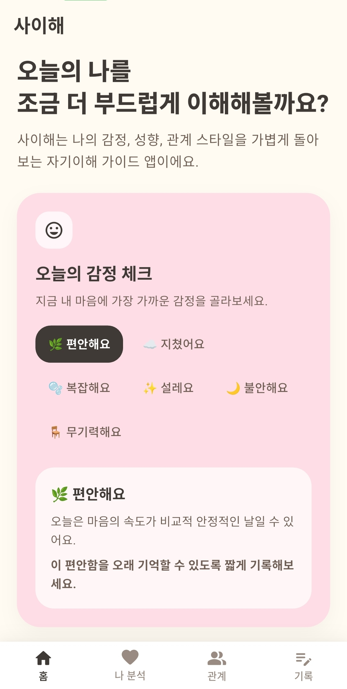
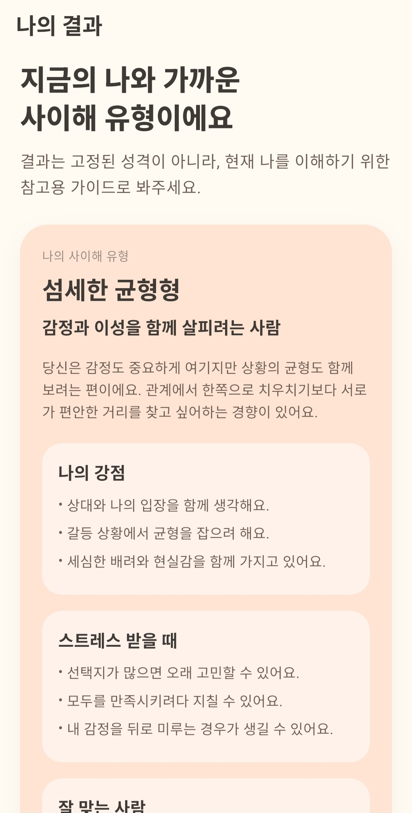
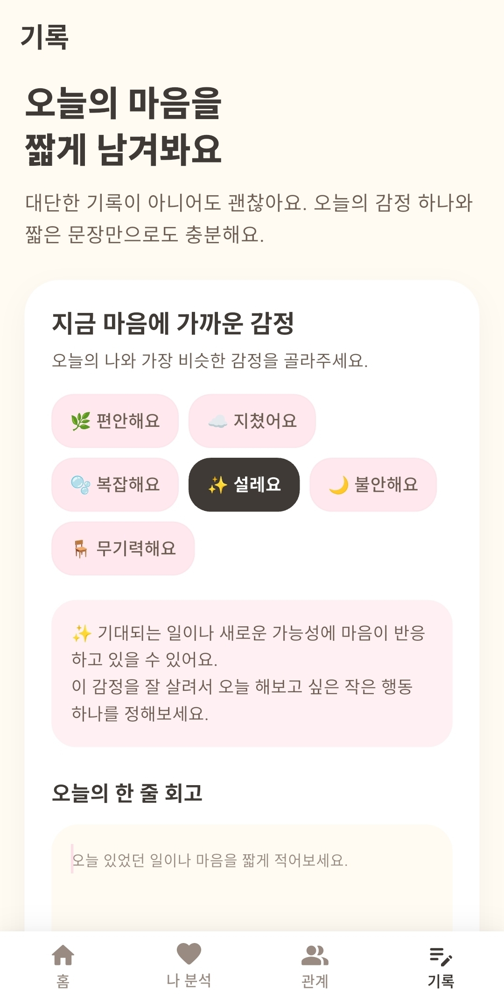

# 사이해

> “사이를 이해하다”와 “나를 이해하다”를 담은 Flutter 기반 자기이해 기록 앱

**사이해**는 감정 기록, 성향 테스트, 관계 가이드, 작은 행동 추천을 통해 사용자가 일상에서 자신의 마음을 가볍게 돌아볼 수 있도록 돕는 앱입니다.
이 앱은 **전문 심리 진단, 상담, 치료 목적이 아닌 자기이해 참고용 서비스**입니다.

로그인, 클라우드 서버, AI API 없이 동작하며, 감정 기록과 성향 결과는 기기 내부의 `shared_preferences`에 저장됩니다.

---

## 1. 프로젝트 소개

| 항목 | 내용 |
|---|---|
| 프로젝트명 | 사이해 |
| 한 줄 소개 | 감정과 성향을 기록하고 관계 스타일을 돌아보는 비진단형 자기이해 앱 |
| 개발 환경 | Flutter / Dart |
| UI 방향 | Material 3 기반 파스텔 카드 UI |
| 저장 방식 | `shared_preferences` 기반 로컬 저장 |
| 네트워크 기능 | 없음 |
| 로그인/클라우드/AI | 구현하지 않음 |
| 저장소 | https://github.com/obagwon/saihae_project.git |

---

## 2. 핵심 기능

### 2-1. 온보딩과 비진단 고지

- 첫 실행 시 사이해의 목적과 사용 방식을 안내합니다.
- “전문 심리 진단/상담/치료 목적이 아닌 자기이해 참고용 앱”이라는 점을 명확히 고지합니다.
- 사용자가 `시작하기`를 누르면 이후 실행부터는 온보딩을 건너뛰고 메인 탭으로 이동합니다.

### 2-2. 오늘의 감정 기록

- 감정 이모지와 라벨을 선택할 수 있습니다.
- 홈 화면에서 감정을 선택하면 `이 감정으로 기록하기` 버튼을 통해 기록 탭으로 이어집니다.
- 기록 탭에서는 선택된 감정이 초기값으로 반영됩니다.

### 2-3. 감정 강도와 한 줄 회고

- 감정 강도를 1~5 단계로 선택합니다.
- 한 줄 회고는 비워도 저장할 수 있습니다.
- 저장된 기록에는 감정 ID, 감정 라벨, 이모지, 강도, 메모, 날짜가 함께 저장됩니다.

### 2-4. 감정 기반 추천

- 선택하거나 저장한 감정과 강도에 따라 작은 행동 추천을 보여줍니다.
- 강도 4~5는 회복 중심, 강도 1~2는 유지/확장 중심 추천을 제공합니다.
- 저장된 성향 테스트 결과가 있으면 성향에 맞는 보조 문장도 함께 보여줍니다.
- 음악/영화/책 추천이 아니라, 바로 해볼 수 있는 행동 추천 중심입니다.

### 2-5. 감정 통계

- 저장된 감정 기록을 기반으로 다음 정보를 보여줍니다.
  - 전체 기록 수
  - 이번 주 기록 수
  - 자주 나타난 감정
  - 최근 7일 평균 감정 강도
  - 최근 7일 날짜별 강도 막대 그래프
- 기록이 없거나 3개 미만일 때는 통계가 아직 참고용이라는 안내를 표시합니다.

### 2-6. 성향 테스트

- 8개 질문에 4단계로 응답합니다.
- 점수 계산은 `PersonalityTestService`에서 처리합니다.
- 동점일 경우 사전에 정의된 성향 순서를 유지합니다.
- 결과는 전문 진단이 아니라 자기이해를 위한 참고용으로 표시됩니다.

### 2-7. 저장된 성향 결과

- 성향 테스트 결과는 로컬에 저장됩니다.
- 나 분석 탭에서 저장된 성향 결과, 테스트 날짜, 점수 요약을 확인할 수 있습니다.
- 결과가 없으면 테스트 시작 안내와 예시 결과 카드를 보여줍니다.

### 2-8. 관계 가이드

- 저장된 성향 결과가 있으면 관계 가이드 탭 상단에 `내 성향 관계 가이드`를 우선 표시합니다.
- 저장된 결과가 없으면 성향 테스트를 유도하는 안내 카드를 보여줍니다.
- 그 아래에는 전체 성향별 관계 가이드 목록을 유지합니다.

---

## 3. 기술 스택

- **Flutter**
- **Dart**
- **Material 3**
- **shared_preferences**
  - 온보딩 완료 여부 저장
  - 감정 기록 저장
  - 성향 테스트 결과 저장
- **flutter_lints**
- **flutter_launcher_icons**

---

## 4. 프로젝트 구조

```text
lib/
├─ app/
│  ├─ app.dart                 # 앱 시작, 온보딩 게이트, MaterialApp
│  └─ theme.dart               # 색상/텍스트/컴포넌트 테마
├─ data/
│  ├─ emotion_data.dart        # 감정 목록과 안내 문구
│  ├─ personality_data.dart    # 성향 유형과 관계 가이드 데이터
│  ├─ recommendation_data.dart # 감정/강도/성향 기반 행동 추천 데이터
│  ├─ test_question_data.dart  # 성향 테스트 질문 데이터
│  └─ tip_data.dart            # 오늘의 작은 회복 팁
├─ models/
│  ├─ app_settings.dart
│  ├─ emotion_record.dart
│  ├─ personality_test_result.dart
│  ├─ personality_type.dart
│  ├─ recommendation_item.dart
│  └─ test_question.dart
├─ screens/
│  ├─ analysis_screen.dart
│  ├─ home_screen.dart
│  ├─ main_tab_screen.dart
│  ├─ onboarding_screen.dart
│  ├─ record_screen.dart
│  ├─ relation_guide_screen.dart
│  ├─ result_screen.dart
│  └─ test_screen.dart
├─ services/
│  ├─ emotion_stats_service.dart
│  ├─ local_storage_service.dart
│  └─ personality_test_service.dart
└─ widgets/
   ├─ emotion_chip.dart
   ├─ recommendation_card.dart
   ├─ result_card.dart
   ├─ rounded_button.dart
   ├─ section_title.dart
   └─ soft_card.dart
```

---

## 5. 실행 방법

### 5-1. 의존성 설치

```bash
flutter pub get
```

### 5-2. 앱 실행

```bash
flutter run
```

### 5-3. 테스트 실행

```bash
flutter test
```

### 5-4. 릴리즈 APK 빌드

```bash
flutter build apk --release
```

---

## 6. 기말 발표 시연 순서 예시

3~5분 안에 핵심 흐름을 보여주기 위한 순서입니다.

1. **첫 실행 온보딩 확인**
   - 사이해의 의미, 감정 기록 방식, 비진단 고지를 보여줍니다.
   - `시작하기`를 눌러 메인 화면으로 이동합니다.

2. **홈에서 감정 선택**
   - 홈의 `오늘의 감정 체크`에서 감정을 선택합니다.
   - 감정 안내 문구와 `이 감정으로 기록하기` 버튼을 보여줍니다.

3. **감정 기록 저장**
   - 기록 탭으로 이동해 선택 감정이 반영된 것을 보여줍니다.
   - 감정 강도를 선택하고 한 줄 회고를 저장합니다.
   - 저장 후 추천 카드가 갱신되는 것을 설명합니다.

4. **감정 통계 확인**
   - 전체 기록 수, 이번 주 기록 수, 자주 나타난 감정, 최근 7일 강도 흐름을 보여줍니다.
   - 기록이 적을 때는 참고용 안내가 표시된다고 설명합니다.

5. **성향 테스트 진행**
   - 나 분석 탭에서 성향 테스트를 시작합니다.
   - 몇 개 질문에 답하고 결과 화면으로 이동합니다.
   - 결과가 로컬에 저장된다는 점을 보여줍니다.

6. **저장된 성향 결과 확인**
   - 나 분석 탭으로 돌아와 저장된 성향 카드와 점수 요약을 확인합니다.

7. **관계 가이드 확인**
   - 관계 가이드 탭에서 `내 성향 관계 가이드`가 상단에 먼저 표시되는 것을 보여줍니다.
   - 아래에 전체 성향별 관계 가이드가 유지되는 것도 함께 확인합니다.

---

## 7. 비진단 고지

사이해는 전문적인 심리 검사, 진단, 상담, 치료를 제공하는 앱이 아닙니다.
앱에서 제공하는 성향 결과, 감정 안내, 추천 행동은 **일상 속 자기이해를 돕기 위한 참고용 콘텐츠**입니다.

불안, 무기력, 우울감, 스트레스가 강하게 오래 지속되거나 일상생활에 큰 어려움이 있다면 혼자 해결하려 하기보다 주변 사람, 학교 상담센터, 지역 정신건강복지센터, 의료기관 등 전문적인 도움을 고려해 주세요.

---

## 8. 로컬 저장과 개인정보 범위

- 현재 앱은 로그인 기능이 없습니다.
- 클라우드 서버나 외부 API로 데이터를 전송하지 않습니다.
- 감정 기록, 성향 결과, 온보딩 완료 여부는 기기 내부 `shared_preferences`에 저장됩니다.
- 앱 삭제 또는 앱 데이터 삭제 시 로컬 저장 데이터가 사라질 수 있습니다.

---

## 9. 테스트 파일

현재 포함된 주요 테스트는 다음과 같습니다.

- `test/widget_test.dart`
  - 앱 시작 후 메인 탭 텍스트가 렌더링되는지 확인합니다.
- `test/personality_test_service_test.dart`
  - 성향 테스트 계산 결과와 점수표 생성을 확인합니다.
- `test/emotion_stats_service_test.dart`
  - 감정 기록 통계 계산을 확인합니다.
- `test/recommendation_data_test.dart`
  - 감정 강도와 fallback 추천 로직을 확인합니다.

---

## 10. 스크린샷

기존 제출용 이미지가 `images/` 폴더에 포함되어 있습니다. 일부 화면은 이후 기능 추가로 실제 최신 UI와 다를 수 있으므로, 최종 제출 전 최신 실행 화면으로 교체하는 것을 권장합니다.

### 앱 아이콘


### 기존 실행 화면 예시

<p align="left">
  
  
  
</p>

---

## 11. 향후 개선 방향

아래 항목은 현재 구현되지 않았으며, 향후 개선 아이디어입니다.

- 감정 기록 월간/주간 리포트 화면 고도화
- 기록 단건 삭제/수정 기능
- 온보딩 다시 보기 또는 설정 초기화 화면
- 성향 결과 변화 이력 저장
- 접근성 개선 및 다양한 화면 크기 대응
- 최신 UI 기준 스크린샷 재촬영
- 정식 배포 전 개인정보 처리 안내 문구 보강

---

## 12. 라이선스

현재 저장소에는 별도의 `LICENSE` 파일이 포함되어 있지 않습니다.
라이선스가 필요한 경우, 제출 또는 배포 전에 라이선스 파일을 추가하고 이 섹션을 갱신해야 합니다.
