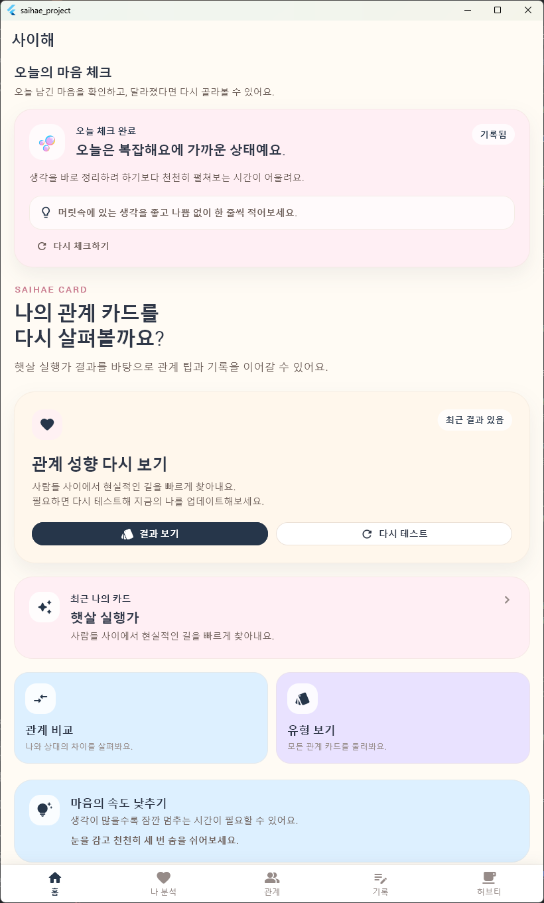

# 사이해

> 대학생을 위한 **참고용 자기이해 서비스** 앱 (Flutter Android 미니 프로젝트)

## 1) 프로젝트 정보

| 항목 | 내용 |
|---|---|
| 프로젝트명 | 사이해 |
| 한 줄 소개 | 감정 체크, 성향 테스트, 관계 가이드, 한 줄 회고 기록을 통해 일상에서 나를 가볍게 이해하는 앱 |
| 개발 환경 | Flutter / Dart |
| 대상 플랫폼 | Android (Flutter 기반) |
| GitHub 저장소 URL | (여기에 본인 저장소 URL 입력) |
| 원본(클론) URL | 사용하지 않음 (직접 기획 및 구현) |

---

## 2) 프로그램 개요

**사이해**는 “사이를 이해하다”, “나를 이해하다”라는 의미를 담은 앱입니다.  
심리검사 앱처럼 딱딱한 느낌보다, 감성 라이프스타일 앱의 분위기를 목표로 기획했습니다.

- 파스텔 톤 중심의 따뜻한 컬러
- 카드 UI, 둥근 모서리, 부드러운 여백/그림자
- 대학생이 부담 없이 사용할 수 있는 톤앤무드

또한 이 앱은 **전문 심리 진단/치료 목적이 아닌, 일상 속 자기이해를 돕는 참고용 서비스**로 구성되어 있습니다.

---

## 3) 주요 기능

### 3-1. 오늘의 감정 체크
- 현재 감정에 가까운 항목(이모지+라벨) 선택
- 선택한 감정에 맞는 안내 문구와 간단한 회복 팁 표시

### 3-2. 오늘의 멘탈 관리 팁
- 날짜 기준으로 멘탈 팁이 바뀌어 표시됨
- 서버 연동 없이 로컬 더미 데이터 기반으로 동작

### 3-3. 간단한 성향 테스트
- 여러 질문에 대해 4단계 응답 선택
- 점수 가중치 계산으로 가장 가까운 성향 유형 도출
- 전문 진단이 아닌 참고용 자기이해 콘텐츠

### 3-4. 성향 결과 카드
- 나의 사이해 유형
- 유형 설명
- 강점
- 스트레스 반응
- 잘 맞는 사람 스타일
- 오늘의 추천 행동

### 3-5. 관계 가이드
- 성향 유형별로
  - 잘 맞는 사람 특징
  - 친해지는 방법
  - 조심하면 좋은 소통 방식
- `personality_data.dart` 기반으로 화면 구성

### 3-6. 감정 기록 및 한 줄 회고 저장
- 감정 선택 후 한 줄 회고 작성/저장
- `shared_preferences`를 이용한 로컬 저장
- 최근 기록 목록 확인 및 전체 삭제 가능

---

## 4) 기술 스택

- **Flutter**
- **Dart**
- **shared_preferences** (로컬 데이터 저장)
- **Material Design 기반 커스텀 UI**
- **flutter_launcher_icons** (앱 아이콘 설정)
  - 아이콘 경로: `assets/icons/app_icon.png`

---

## 5) 프로젝트 구조

```text
lib/
├─ app/            # 앱 전체 설정, 테마 관리
├─ models/         # 성향 유형, 멘탈 팁, 감정 기록 모델
├─ data/           # 성향/감정/멘탈 팁 더미 데이터
├─ screens/        # 홈, 나 분석, 테스트, 결과, 관계 가이드, 기록 화면
├─ widgets/        # 공통 UI 컴포넌트(카드, 버튼, 감정 칩, 결과 카드 등)
└─ services/       # shared_preferences 기반 로컬 저장 서비스
```

### 주요 화면
- 홈 화면 (`home_screen.dart`)
- 나 분석 화면 (`analysis_screen.dart`)
- 성향 테스트 화면 (`test_screen.dart`)
- 결과 화면 (`result_screen.dart`)
- 관계 가이드 화면 (`relation_guide_screen.dart`)
- 기록 화면 (`record_screen.dart`)

---

## 6) 실행 방법

### 기본 실행
```bash
flutter pub get
flutter run
```

### APK 빌드 (릴리즈)
```bash
flutter build apk --release
```

---

## 7) 스크린샷

> 과제 제출 시 실행 화면 캡처 2장 이상 첨부

### 홈 화면


### 성향 테스트 화면


### 결과 화면


### 기록 화면


---

## 8) 본인이 구현한 부분

- 앱 기획 및 브랜딩 방향 설정
- “사이해” 앱 콘셉트 구성
- 파스텔 톤 기반 UI 방향 설정
- 홈 / 나 분석 / 관계 가이드 / 기록 화면 구성
- 성향 테스트 질문 및 결과 유형 설계
- 성향 테스트 점수 계산 로직 구현
- 감정 체크 및 멘탈 팁 더미 데이터 구성
- `shared_preferences` 기반 감정 기록 저장 기능 구현
- 공통 위젯(카드/버튼/칩/결과 카드 등) 분리
- 앱 이름 및 앱 아이콘 설정
- 실제 실행 테스트 및 화면 캡처 준비

---

## 9) AI 활용 여부 및 활용 범위

- ChatGPT/Codex를 활용하여 다음 항목에서 도움을 받았습니다.
  - 앱 아이디어 구체화
  - 화면 구조 설계
  - README 초안 작성
  - Flutter 코드 작성 보조
  - 오류 점검
- 최종 기능 선택, 프로젝트 방향 결정, 코드 적용, 실행 테스트, 제출물 정리는 모두 본인이 수행했습니다.
- AI 생성 결과를 그대로 제출하지 않고, 과제 목적에 맞게 직접 수정/반영했습니다.

---

## 10) 라이선스

본 프로젝트는 **MIT License**를 따릅니다.

